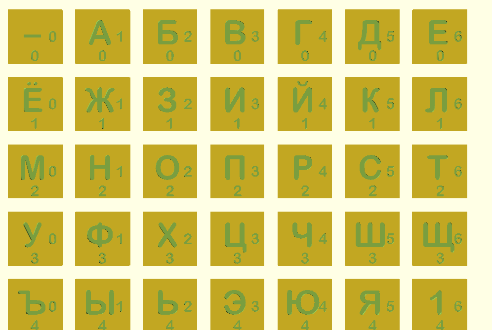

# Ручной шифр LS47

Данный шифр является небольшим усовершенствованием шифра ElsieFour,
который разработал Алан Камински (Alan Kaminsky) [1].
В этом варианте используются 7x7 символов вместо оригинальных 6x6, которых
едва-едва хватает даже на латинский алфавит.
Дополнительно описан простой алгоритм получения ключа по паролю,
как более привычный вариант.
Стойкость и безопасность такие же как у ElsieFour.

Также есть 3D–модель фишек в форматах SCAD и STL.


Рекомендуем печатать модель с использованием более чем одного цвета, чтобы
символы были видны более отчётливо.
Спасибо Мартину Пташеку (Martin Ptasek) за изображение.

Если вы доверяете своему компьютеру, то есть простая реализация на питоне
`ls47.py`.
Также Бернард Эсслингер (Bernhard Esslinger) из проекта CrypTool
предоставил более удобный вариант `lc4.py`, который реализует несколько
вариантов дополнения и оригинальный шифр ElsieFour.

### Алфавит и расположение символов

По сравнению с оригинальным вариантом, добавлены символы пунктуации,
кавычки, символы для записи арифметических выражений.
Для варианта с кириллицей пришлось ограничиться только символами
пунктуации.
Символы на фишках упорядочены вот так (показаны рядом варианты с латиницей
и кириллицей):

```
_ a b c d e f      _ а б в г д е
g h i j k l m      ё ж з и й к л
n o p q r s t      м н о п р с т
u v w x y z .      у ф х ц ч ш щ
0 1 2 3 4 5 6      ъ ы ь э ю я 1
7 8 9 , - + *      2 3 4 5 6 7 8
/ : ? ! ' ( )      9 0 . , ; ? !

```

Как видно, на фишках полезно иметь дополнительную информацию, для
облегчения операций:



Для выполнения операций по зашифровке/расшифровке необходима метка,
например, камешек, гайка или что-то подобное, что устойчиво помещается на фишке.

## Операции

Подробнее процессы описаны в [1].
Здесь дадим сжатое изложение процессов.


### Шифрование

1.  Начальное расположение фишек является симметричным ключом.
    Расположите фишки квадратом 7x7 согласно ключу.
2.  Поместите метку на позицию (0,0).
3.  Найдите среди фишек символ, который собираетесь зашифровать, назовём
    его позицию `P`.
4.  Посмотрите на метку, цифры на её фишке это координаты `M`.
5.  Определите позицию зашифрованного символа как `C := P + M mod (7,7)`.
    Запишите зашифрованный символ, расположенный на позиции `C`.
6.  Циклически сдвиньте вправо строку фишек, на которой находится исходный символ, который мы зашифровали.
    Если метка находится на этой строке, то она сдвигается вместе с фишками.
7.  Циклически сдвиньте вниз столбец фишек, в котором сейчас находится зашифрованный символ.
    Если метка находится на этом столбце, то она сдвигается вместе с фишками.
8.  Обновите позицию метки: `M := M + C' mod (7,7)`, где `C'` — это цифры
    на фишке с зашифрованным символом.
9.  Для всех остальных символов оставшегося текста, повторите операции
    начиная с пункта 3.

#### Пример шифрования с текстовыми иллюстрациями

```
1,2. Начальное положение/ключ   3,4. Шифруем символ '.'
                                     Фишка с меткой выглядит так:

  [д]! м 5 б р к                     /-----\
   ъ а х , с л ю                     |     |
   ы ь в 2 6 у _                     | д  5|
   0 ф ? 8 ш щ и                     |   0 |
   3 г е я 1 ч .                     \-----/
   э ; й ё ц 4 п
   о н з т ж 7 9

5. Зашифрованный символ '1'     6. Сдвигаем вправо ряд фишек,
   (отсчитали от '.'               содержащих '.'
   пять фишек вправо,
   ноль вниз)
                               [д]! м 5 б р к         [д]! м 5 б р к
                                ъ а х , с л ю          ъ а х , с л ю
   Запишем '1'!                 ы ь в 2 6 у _          ы ь в 2 6 у _
                                0 ф ? 8 ш щ и          0 ф ? 8 ш щ и
                                  3 г е я 1 ч .  >>    . 3 г е я 1 ч
                                э ; й ё ц 4 п          э ; й ё ц 4 п
                                о н з т ж 7 9          о н з т ж 7 9

7. Сдвигаем вниз столбец фишек,            Посмотрим на фишку с
   содержащих зашифрованный                зашифрованным символом:
   символ '1'

  [д]! м 5 б   к        [д]! м 5 б 7 к     /-----\
   ъ а х , с р ю         ъ а х , с р ю     |     |
   ы ь в 2 6 л _         ы ь в 2 6 л _     | 1  6|
   0 ф ? 8 ш у и   >>    0 ф ? 8 ш у и     |   4 |
   . 3 г е я щ ч         . 3 г е я щ ч     \-----/
   э ; й ё ц 1 п         э ; й ё ц 1 п
   о н з т ж 4 9         о н з т ж 4 9
             7

8. Обновим позицию метки        9. Переход на пункт 3.
   путём сдвига согласно
   значениям на фишке с
   зашифрованным символом,
   т. е. (6,4)

   д ! м 5 б 7 к
   ъ а х , с р ю
   ы ь в 2 6 л _
   0 ф ? 8 ш у и
   . 3 г е я щ[ч]
   э ; й ё ц 1 п
   о н з т ж 4 9

```


### Расшифровка

Расшифровка выполняется практически теми же шагами, за исключением того,
что на шаге 5 необходимо определить позицию `P` по известным позициям `M` и `C`.
`P` определяется вычитанием `P := C - M mod (7,7)`.
Остальные шаги идентичны.

### Генерация ключей

Хорошо перемешайте фишки в мешочке и достаньте их по одной.
Ключом является перестановка этих 49 элементов.

### Генерация ключа по паролю

Помнить случайную перестановку из 49 элементов не очень удобно, особенно,
когда среди этих элементов служебные символы.
Вместо этого можно порождать ключи из произвольной строки достаточной
длины.

Под "достаточной длиной" подразумевается "с достаточным уровнем энтропии".
Полные ключи хранят около 208 бит энтропии.
Чтобы достичь похожих показателей, ваш пароль должен состоять (для варианта
из латиницы):

- как минимум из 61 цифры, если состоит только из случайно выбранных цифр
- как минимум из 44 букв, если состоит только из случайно выбранных букв
- как минимум из 40 цифробуквенных символов, если состоит только из них


Чтобы получить "стандартные" 128 бит энтропии, числа уменьшаются примерно
до 39, 28 и 25 соответственно.

Полученную расстановку можно сохранить, чтобы не заниматься генерацией
ключа каждый раз, когда выполняется операция шифрования/расшифрования.

Алгоритм порождения ключа следующий:

1.  Расставьте фишки в начальном порядке (т. е. как на первоначальной
    картинке).
    `I := 0`.
2.  Возьмите первый символ пароля и отметьте числа на соответствующей
    фишке: `Px, Py`
3.  Сдвиньте `I`–ю строку на `Px` позиций вправо
4.  Сдвиньте `I`–й столбец на `Py` позиций вниз
5. `I := I + 1 mod 7`, повторить с пункта 2 и следующим символом пароля
6.  Получившаяся расстановка фишек и есть ключ

### Неразличимые шифротексты

Чтобы получить различные шифротексты даже для одинакового исходного текста,
к нему надо добавить случайное одноразовый код заранее условленной
длины.
Например, `N` случайно выбранных из мешочка фишек, рекомендуемое значение
`N` — как минимум 10.

Также стоит дополнять исходное сообщение случайным числом символов, чтобы
предотвратить идентификацию между 'да, пожалуйста' и 'нет', что легко
сделать, даже не зная ключ и видя `ч2390смю238ы_т` и `ч9ч`.

### Аутентифицированное шифрование

Поскольку шифротекст может быть изменён во время передачи или может быть
допущена ошибка во время обработки человеком, то рекомендуется добавлять
подпись в конце сообщения.
Достаточно даже просто `__ВашеДосточтимоеИмяЗдесь`.
Если подпись не соответствует ожиданиям, что легко может произойти в случае
ошибки при обработке, то либо попробуйте заново (вдруг ошибка при
расшифровке?), либо попросите отправителя переслать сообщение.

Это возможно потому, что выход шифра зависит от сообщения: при ошибочном
значении где-нибудь в середине, из-за лавинного эффекта сообщение теряет
смысл после нескольких символов.

## Ссылки

[1] *Kaminsky, Alan. "ElsieFour: A Low-Tech Authenticated Encryption Algorithm For Human-to-Human Communication." IACR Cryptology ePrint Archive 2017 (2017): 339.*
